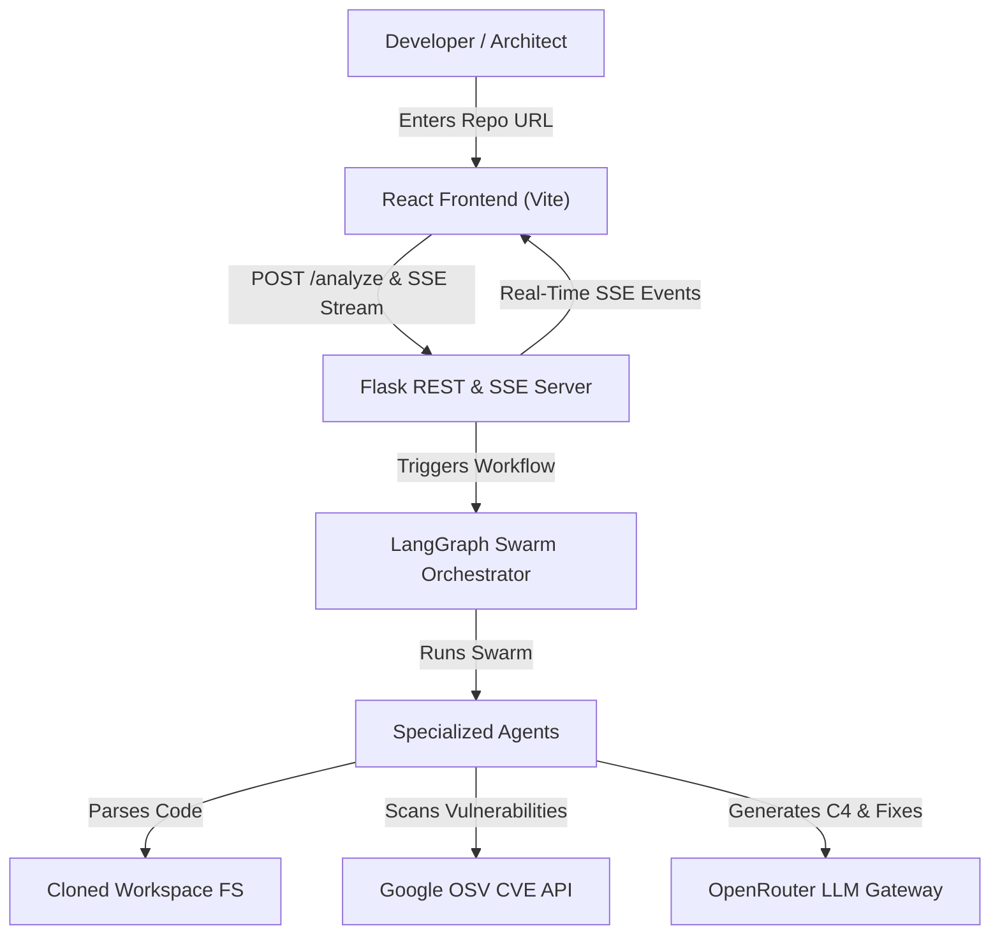

# RepoSense

> **Autonomous AI-Powered Repository Intelligence & System Architecture Platform**

RepoSense is an autonomous, graph-native engineering intelligence platform built with a **Python (Flask + LangGraph)** backend and a modern **React** frontend. It deploys a swarm of specialized AI agents to analyze public GitHub repositories, generate interactive dependency graphs, reverse-engineer software architectures, identify security vulnerabilities, compute impact analysis, and generate remediation patches while streaming progress in real time using Server-Sent Events (SSE).

---

## Key Features

### Dynamic Dependency Graph

* AST-based source code parsing
* Extracts module imports, classes, functions, and file dependencies
* Generates an interactive repository dependency graph
* Visualizes relationships between project components

### System Architecture Analysis

* Reverse-engineers complete software architecture
* Generates Structurizr C4 models

  * System Context
  * Container
  * Component
* Produces request flow diagrams
* Renders architecture using Mermaid.js

### Security Scanning

Performs both heuristic analysis and vulnerability database scanning.

**Static Security Detection**

* Hardcoded credentials
* SQL injection risks
* Insecure subprocess execution
* Command injection
* Unsafe deserialization
* Additional critical security anti-patterns

**OSV Vulnerability Detection**

* Scans dependency manifests including:

  * `requirements.txt`
  * `package.json`
  * `poetry.lock`
  * `package-lock.json`
* Queries Google's OSV database for known CVEs

### Blast Radius Impact Analysis

* Calculates downstream dependency impact
* Identifies affected modules and files
* Measures dependency propagation
* Highlights critical graph nodes

### Universal LLM Gateway

* Integrates with OpenRouter
* Supports more than 200 language models
* Dynamic provider selection
* Automatic fallback support

Compatible providers include:

* Gemini
* Claude
* GPT
* Llama
* DeepSeek
* Mistral
* Qwen

### Repository Q&A

Ask natural language questions about:

* Repository architecture
* Code quality
* Dependency relationships
* Security posture
* Project structure

Supports repository context up to **20,000 characters**.

### Real-Time Agent Activity

Monitor every stage of repository analysis through Server-Sent Events (SSE).

Includes:

* Live workflow progress
* Agent status
* Execution logs
* State transitions
* Generated artifacts

### Repository Comparison

Compare two repositories side by side using the `/compare` endpoint.

Comparison includes:

* Quality metrics
* Security findings
* Dependency complexity
* Architecture insights
* Recommendations

### Human-in-the-Loop Fix Approval

* AI-generated remediation patches
* Supervisor approval before applying changes
* Safe and controlled code modifications

---

## Repository Size & Capacity

RepoSense is designed to efficiently analyze repositories ranging from small projects to large enterprise codebases.

| Parameter                   | Default               | Environment Variable    | Description                                                                                            |
| --------------------------- | --------------------- | ----------------------- | ------------------------------------------------------------------------------------------------------ |
| Maximum Repository Files    | **8,000**             | `MAX_REPO_FILES`        | Maximum number of source files analyzed (excluding `.git`, `node_modules`, `venv`, and `__pycache__`). |
| Git Clone Timeout           | **120 seconds**       | `CLONE_TIMEOUT_SEC`     | Maximum duration allowed for shallow repository cloning.                                               |
| Detailed File Analysis      | **100 files**         | Internal                | Maximum files processed for detailed AST parsing and feature extraction.                               |
| Architecture Context Window | **16,000 tokens**     | `max_input_tokens`      | Maximum context sent to the LLM for architecture generation.                                           |
| LLM Output Limit            | **8,192 tokens**      | `max_output_tokens`     | Maximum generated output size for architecture and analysis.                                           |
| Repository Q&A Context      | **20,000 characters** | Internal                | Maximum repository context provided during interactive Q&A.                                            |
| Session Cache Duration      | **24 hours**          | `SESSION_MAX_AGE_HOURS` | Duration for retaining repository analysis sessions.                                                   |

> **Scaling for Large Repositories**
>
> For repositories larger than **8,000 files**, update your `.env` configuration:
>
> ```env
> MAX_REPO_FILES=25000
> CLONE_TIMEOUT_SEC=300
> ```
>
> Increasing these values allows RepoSense to process significantly larger codebases while providing sufficient time for repository cloning and analysis.


---

## 🏗 Architecture Overview



### Agent Swarm Modules
- **`DependencyAgent`**: Scans tree, parses imports, builds AST dependency graph (`graph_builder.py`).
- **`SecurityAgent`**: Performs heuristic security rules scan & queries OSV CVE API (`security_scanner.py`, `tools.py`).
- **`ImpactAgent`**: Computes blast radius metrics and graph node centrality (`graph_builder.py`).
- **`ArchitectureAgent`**: Generates Mermaid C4 models & request flowcharts (`architecture.py`).
- **`FixAgent`**: Produces remediation code patches requiring supervisor approval (`fixer.py`).
- **`ExplanationAgent`**: Handles repository Q&A deep dives (`orchestrator.py`).
- **`MonitorAgent`**: Tracks session state, logs, and health metrics (`snapshot.py`).

---

## 🛠 Quick Start

### 1. Prerequisites
- **Python 3.10+**
- **Node.js 18+** & **npm**
- **Git**

### 2. Environment Setup
Create a `.env` file in the project root:

```env
PORT=8000
OPENROUTER_API_KEY=your_openrouter_api_key_here
MAX_REPO_FILES=8000
CLONE_TIMEOUT_SEC=120
```

### 3. Backend Setup & Run

```bash
# Install Python dependencies
pip install -r requirements.txt

# Launch backend API server
python -m backend.server
```
*Backend runs on `http://localhost:8000`.*

### 4. Frontend Setup & Run

```bash
# Navigate to frontend
cd frontend

# Install dependencies
npm install

# Start Vite dev server
npm run dev
```
*Frontend runs on `http://localhost:5173`.*

---

## 🧪 Running Tests

```bash
# Run unit & integration tests
pytest tests/
```

---

## 📄 License

MIT License. Built for developer productivity and repository transparency.
