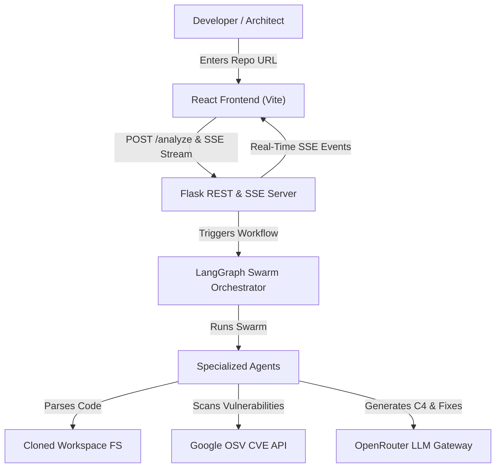

# RepoSense

> **Autonomous AI-Powered Repository Intelligence & System Architecture Platform**

RepoSense is an autonomous, graph-native engineering mission control platform built with a Python (Flask + LangGraph) backend and a modern React frontend. It deploys a swarm of specialized agents to deeply analyze public GitHub repositories, rendering dynamic dependency graph maps, reverse engineering system architectures, identifying security vulnerabilities, and generating automated remediation patches—all monitored in real time via Server-Sent Events (SSE).

---

## 🌟 Key Features

- **📊 Dynamic Dependency Graph Map:** AST-based code parsing that extracts module imports, functions, classes, and file dependencies into an interactive spatial graph.
- **🏗 System Architecture Analyzer:** Reverse-engineers complete repository software architecture into Structurizr C4 models (System Context, Container, Component) and request flowcharts using AI, rendered live via Mermaid.js.
- **🛡 Heuristic & OSV CVE Security Scanning:** 
  - Detects 9 critical code security anti-patterns (hardcoded credentials, SQL injection risks, insecure subprocesses, command execution, unsafe deserialization).
  - Queries Google's OSV database for known vulnerabilities (CVEs) across `requirements.txt`, `package.json`, etc.
- **🎯 Blast Radius Impact Analysis:** Calculates downstream impact of code changes, modified files, and security findings across the entire dependency graph.
- **🤖 Universal LLM Gateway & Provider Selector:** Integrates OpenRouter for access to 200+ models (Gemini 2.5 Flash, Claude 3.5 Sonnet, GPT-4o, Llama 3.3, DeepSeek, etc.) with a dynamic UI dropdown selector and automatic heuristic fallback.
- **💬 Repository Deep-Dive Q&A:** Ask natural language questions about the repository structure, code quality, security posture, or architecture, powered by deep contextual prompts (up to 20k characters).
- **⚡ Real-Time Agent Activity Center (SSE):** Monitor multi-agent progress, state transitions, and step-by-step logs via SSE streaming.
- **⚖ Dual-Repo Comparison:** Compare two repositories side-by-side (quality scores, security issues, dependency complexity, recommendations) via the `/compare` endpoint.
- **🛡 Human-in-the-Loop Fix Approvals:** Automated code patch generation with explicit supervisor approval before applying fixes.

---

## 📊 Repository Size & Capacity Limits

RepoSense is optimized to handle both small scripts and large enterprise codebases efficiently. Here are the exact scale parameters:

| Metric / Parameter | Default Capacity | Config Environment Variable | Description |
| :--- | :--- | :--- | :--- |
| **Max Repository Files** | **8,000 files** | `MAX_REPO_FILES` | Total non-ignored source files processed per scan. Excludes `.git`, `node_modules`, `venv`, `__pycache__`. |
| **Git Clone Timeout** | **120 seconds** | `CLONE_TIMEOUT_SEC` | Maximum allowed time for `git clone --depth 1` shallow operations. |
| **Analyzed File Sampling** | **Up to 100 files** | Internal | AST import parsing & detailed feature extraction. |
| **Architecture Context Window** | **16,000 tokens (~64 KB)** | `max_input_tokens` | Prompt capacity sent to LLM for full directory tree & config analysis. |
| **LLM Output Token Limit** | **8,192 tokens** | `max_output_tokens` | Max response size for complex C4 JSON models and architectural flowcharts. |
| **Q&A Context Window** | **20,000 characters** | Internal | Aggregated context size passed for interactive repository Q&A. |
| **Session Expiry / Cache** | **24 hours** | `SESSION_MAX_AGE_HOURS` | Live session snapshot cache retention period. |

> 💡 **Tackling Larger Repositories:** For codebases exceeding 8,000 files, set `MAX_REPO_FILES=25000` and increase `CLONE_TIMEOUT_SEC=300` in your `.env` file.

---

## 🏗 Architecture Overview



### Agent Swarm Modules
- **`DependencyAgent`**: Scans tree, parses imports, builds AST dependency graph (`graph_builder.py`).
- **`SecurityAgent`**: Performs heuristic security rules scan & queries OSV CVE API (`security_scanner.py`, `tools.py`).
- **`ImpactAgent`**: Computes blast radius metrics and graph node centrality (`graph_builder.py`).
- **`ArchitectureAgent`**: Generates Mermaid C4 models & request flowcharts (`architecture.py`).
- **`FixAgent`**: Produces remediation code patches requiring supervisor approval (`fixer.py`).
- **`ExplanationAgent`**: Handles repository Q&A deep dives (`orchestrator.py`).
- **`MonitorAgent`**: Tracks session state, logs, and health metrics (`snapshot.py`).

---

## 🛠 Quick Start

### 1. Prerequisites
- **Python 3.10+**
- **Node.js 18+** & **npm**
- **Git**

### 2. Environment Setup
Create a `.env` file in the project root:

```env
PORT=8000
OPENROUTER_API_KEY=your_openrouter_api_key_here
MAX_REPO_FILES=8000
CLONE_TIMEOUT_SEC=120
```

### 3. Backend Setup & Run

```bash
# Install Python dependencies
pip install -r requirements.txt

# Launch backend API server
python -m backend.server
```
*Backend runs on `http://localhost:8000`.*

### 4. Frontend Setup & Run

```bash
# Navigate to frontend
cd frontend

# Install dependencies
npm install

# Start Vite dev server
npm run dev
```
*Frontend runs on `http://localhost:5173`.*

---

## 🧪 Running Tests

```bash
# Run unit & integration tests
pytest tests/
```

---

## 📄 License

MIT License. Built for developer productivity and repository transparency.
